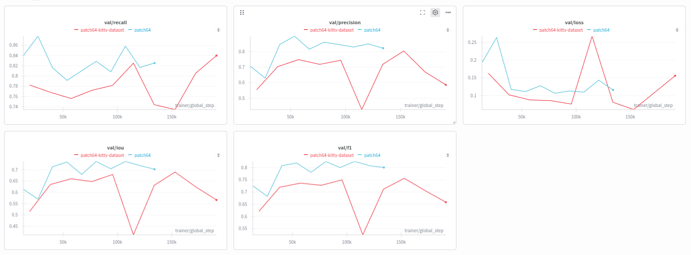
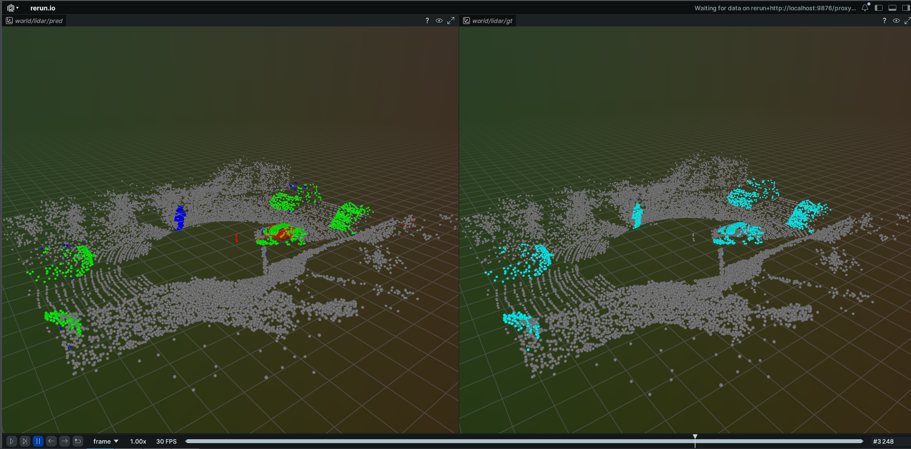
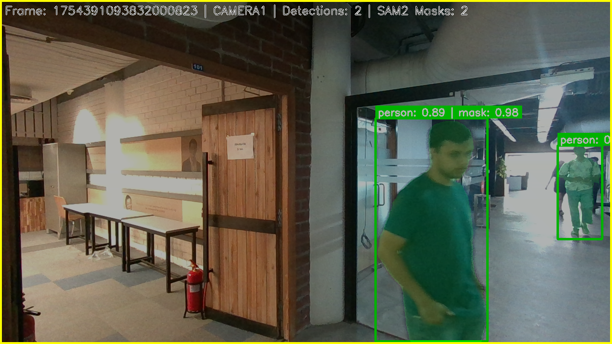

# baseline-scripts for temporal-point-transformer
1) Extra utility codes for adapting `Motion Object Segmentation Algoritms` for JRDB dataset and semantic kitty dataset. 
2) Custom Data Annotation pipeline in `Semantic Kitty` format for converting an rosbag into annotated data for `Motion Object Segmentation Algoritms` using YOLOv8 + SAM2.

## semantic kitty scripts
- the files are placed in `training_script_semantic_kitty` directory

- semantic kitty dataset structure, Download it from here [SemanticKITTI](http://www.semantic-kitti.org/dataset.html#download) (including **Velodyne point clouds**, **calibration data** and **label data**).
- instructions for JRDB will be added soon and scripts are in `training_script_JRDB` directory
```
DATAROOT
└── sequences
    ├── 00
    │   ├── poses.txt
    │   ├── calib.txt
    │   ├── times.txt
    │   ├── labels
    │   └── velodyne
    |── 01-10

# sequences for training: 00-10
# sequences for validation: 08
# sequences for testing: 08
```

- activate the evironment (the environment file is environment.yml)
```
conda env create -f environment.yml
conda activate lidar_moseg
pip install e .
```
- to run and test the train dataloader and test dataloader script (move this script to the dataloader directory in codebase which ever is used)
```
python3 dataloaders/semantic_kitty.py
```
- to run the training script use (-m to be used when running in a module otherwise it not reqired also put this code in scripts directory)
```
tmux new -s training
tmux a -t training
python3 -m scripts.train_semantic_kitty.py 
```
- to use the first GPU on your system incase  it is not detected use this
```
export CUDA_VISIBLE_DEVICES=0
```
- To run the evaluation script for semantic kitty use
```
python3 -m scripts.eval_semantic_kitty --config_path <path>/config/semantic_kitty_config.yaml --checkpoint_path <path>/best-checkpoint-epoch=07-val_loss=0.00-v1.ckpt
```

- the utilities for point cloud  processing is present in `pointcloud_utils.py` and the config used for training along with the split is present in config folder in `semantic_kitty_config.yaml`

## Results
- by default, wandb logging is turned on, so if you wish to use your wandb account, please make a .env file, with your wandb api key as follows
```
WANDB_API_KEY=<YOUR-API-KEY>
```
- also change the `semantic-kitty-config.yaml` to add the details
```
logging:
  wandb:
    run_root_dir: "/scratch/<username>/temporal-point-transformer"
    project: "add your project here"
    entity: "add your entity here"
    log_model: False
    save_code: False
    group: "temporal-point"
    name: "patch64-semantic-kitty"
    resume: "never"
    log_dir: "/scratch/<username>/temporal-point-transformer/logs"
```
- Blue line is on JRDB dataset and red line is on Semantic kitty dataset


- In Scripts folder `eval_semantic_kitty.py` should print the output below in this way for sequence 8
```
==================================================
🧪 Test Metrics Summary
==================================================
🔸 Loss      : 0.0536
🔸 IoU       : 0.7081
🔸 Precision : 0.8105
🔸 Recall    : 0.7468
🔸 F1 Score  : 0.7655
==================================================
```

## Visualization
- use rerun to visualize the result.
```
rerun --serve & disown
python3 -m scripts.visualize_semantic_kitty --config_path <path>/config/semantic_kitty_config.yaml --checkpoint_path <path>/best-checkpoint-epoch=07-val_loss=0.00-v1.ckpt
```
- left side is the predictions and right side is the ground truth


## ROSbag processing for custom Dataset

- remember to change the directories in the bash scripts as per your directory path for seamless usage
```
# for ROS2 humble bags
./rosbag_processing_script/process_ros2_bag.sh

# for ROS1 noetic bags
./rosbag_processing_script/process_ros1_bag.sh
```
- it gives a directory with images,camera intrinsics and pointclouds seperately with synced timestamps
```
DATAROOT
└──bag name
    ├── camera1_images      # (.png format) (format : 0000000000000000000.png)
    ├── camera1_intrinsics  # (.npz format) (format : D,K,height,width)
    ├── camera2_images      # (.png format) (format : 0000000000000000000.png)
    ├── camera2_intrinsics  # (.npz format) (format : D,K,height,width)
    ├── lidar               # (.pcd format) (format : 0000000000000000000.pcd)
```

##  Custom Data Annotation
1) Multi-Camera Support: Leverages both front and back cameras

2) Synchronized Data: Properly handles temporal synchronization

3) Semi-Automatic: YOLO pre-annotation reduces manual work

4) Frustum Projection: Accurate 3D labeling from 2D detections

5) Visualization: Comprehensive visualizations for quality control
```
# Step 1: Analyze data
python custom_analyzer.py /path/to/DATAROOT/my_bag

# Step 2: Generate annotations (with YOLOv8 only)
pip install ultralytics
python rosbag_processing_script/rosbag_custom_annotator.py my_bag_sync_map.json --output my_bag_annotations

OR
# Step 2: Generate annotations (with YOLOv8 + SAM2 )
pip install git+https://github.com/facebookresearch/segment-anything-2.git
python3 rosbag_processing_script/enhanced_annotater.py my_bag_sync_map.json --output annotation_sam2

# Step 3: Convert to KITTI
python convert_to_kitti.py my_bag_annotations --output my_kitti_dataset
```

Custom Data structure after running the code above with YOLO
```
output_directory/
├── labels/                    # .label files
├── visualizations/            # .pcd files (labeled point clouds)
├── visualization_camera_1/    # .png files from camera 1
│   ├── 0000000000000000001_camera1.png
│   ├── 0000000000000000002_camera1.png
│   └── ...
├── visualization_camera_2/    # .png files from camera 2
│   ├── 0000000000000000001_camera2.png
│   ├── 0000000000000000002_camera2.png
│   └── ...
└── annotation_summary.json
```
Custom Data structure after running the code with YOLO+SAM2
```
annotations_YOLO_SAM2/
├── labels/                          # .label files for point cloud labels
├── visualization/                   # Labeled point clouds (.pcd)
├── visualization_camera_1/          # Camera 1 with bounding boxes + mask overlays
├── visualization_camera_2/          # Camera 2 with bounding boxes + mask overlays
├── segmentation_masks/
│   ├── camera1/                     # Individual SAM2 masks for camera1
│   ├── camera2/                     # Individual SAM2 masks for camera2
│   ├── TIMESTAMP_camera1_combined.png
│   └── TIMESTAMP_camera2_combined.png
├── annotation_summary.json         # Complete summary (JSON-safe)
└── annotation_summary_simplified.json  # Fallback if main JSON fails
```


## How Moving vs. Static Labels Are Assigned ?
- In the pipeline, each 3D LiDAR point is ultimately labeled moving (1) or static (0) based on whether it falls within a 3D “frustum” or projected SAM2 mask of any detected object class deemed “moving.” and detect 2D Objects in the Image

- We run YOLOv8 on each camera image.

- We keep only detections whose class ID is in our moving_classes set:
  `{ person, bicycle, car, motorcycle, bus, truck, bird, cat, dog }`.

- Each detection yields a 2D bounding box `[x1, y1, x2, y2]` and (optionally) a SAM2 mask.

### Optionally Refine with SAM2

- If SAM2 is enabled and initialized, we pass each bounding box to SAM2 to get a pixel-precise mask.

- We store each mask (as a binary array) and its mask_area (pixel count) in the detection.

### Create a 3D Frustum or Mask Projection

- Bounding-box frustum: We take the 4 corners of the 2D box, back-project them using the camera intrinsics into two planes at near/far depths. These eight 3D points define a truncated pyramid (“frustum”).

- Mask-based projection (optional): If a SAM2 mask exists, we project each LiDAR point into the camera image plane. We then test whether that 2D projection falls inside the mask. This method tends to be more accurate than the frustum.

### Label Points Moving vs. Static

- We initialize a label array `labels = np.zeros(num_points)`.

- For each detection:

1) If using the mask, we `compute mask_indices = filter_points_with_mask_projection(points, detection, intrinsics)`

2) Otherwise, we compute `mask_indices = filter_points_in_frustum(points, frustum_vertices)`.

3) All points where `mask_indices == True` are set to 1 (moving).

### Save Labels

The final labels array `(0 = static, 1 = moving)` is written out in the same binary format as SemanticKITTI: one uint32 per point.

## Acknowledgment
- I have used [temporal-point-transformer](https://github.com/LiDAR-Motion-Segmentation/temporal-point-transformer) model to train and evaluate on.

## Citation
```
@article{ravi2024sam2,
  title={SAM 2: Segment Anything in Images and Videos},
  author={Ravi, Nikhila and Gabeur, Valentin and Hu, Yuan-Ting and Hu, Ronghang and Ryali, Chaitanya and Ma, Tengyu and Khedr, Haitham and R{\"a}dle, Roman and Rolland, Chloe and Gustafson, Laura and Mintun, Eric and Pan, Junting and Alwala, Kalyan Vasudev and Carion, Nicolas and Wu, Chao-Yuan and Girshick, Ross and Doll{\'a}r, Piotr and Feichtenhofer, Christoph},
  journal={arXiv preprint arXiv:2408.00714},
  url={https://arxiv.org/abs/2408.00714},
  year={2024}
}
```