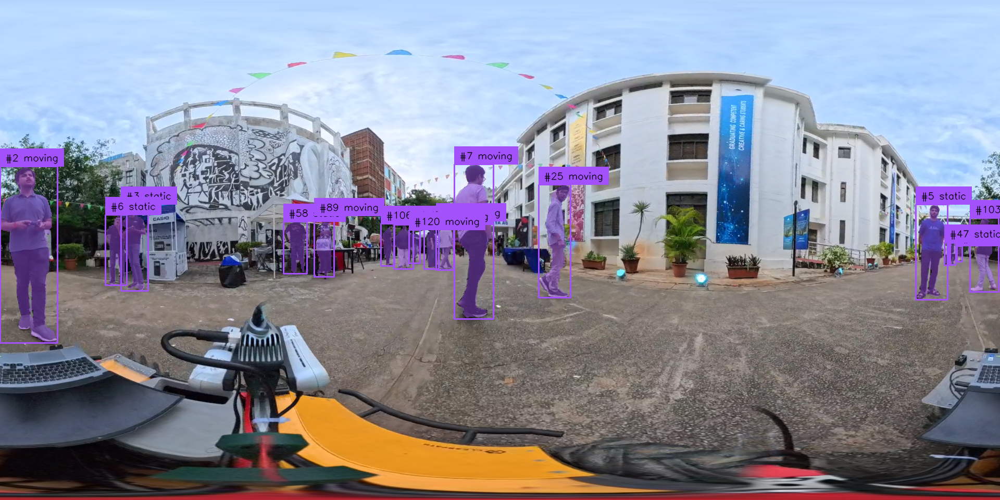

# Auto annotation pipeline for wheelchair project
1) Custom Data Parsing from ROSbags and Data Annotation pipeline in `Semantic Kitty` format for converting an rosbag into annotated data for `Motion Object Segmentation Algoritms` using `YOLOv8 + SAM2`.
2) Hardware setup for custom data collection
3) Docker devcontainer and RVIZ2 setup for visualization
4) Image based multi object tracking using `YOLOv8 + SAM2 + SAHI + NMS` for detecting and tracking people walking at a distance in equirectangular images using `ByteTrack` for automated annotation pipeline for pointclouds with `RANSAC` for ground plane removal and outliers removal and `PCA` for orientation of 3D bounding box.
5) Backprojection of `SAM masks` from 2D image to 3D pointcloud space using 5 intel realsense cameras 
6) Deployment on `NVIDIA Jetson Orin NX` using `ONNX` and `TensorRT` for faster inferencing and realtime operation.
7) Multi Camera based Multi Object Tracking using 5 intel realsense cameras with `BoT-SORT` + `Torchreid` + `RTMPose` for detecting moving non moving people
8) Benchmarking results on `MOT Challenge`  
9) Extra utility codes for adapting `Motion Object Segmentation Algoritms` for JRDB dataset and semantic kitty dataset for testing pointcloud based tracking algorithms for moving and non-moving objects segmentation


## ROSbag processing for custom Dataset

- remember to change the directories in the bash scripts as per your directory path for seamless usage
- change the bash file to uncomment the lines if your run out of memory
```
# for ROS2 humble bags
conda deactivate
./rosbag_processing_script/process_ros2_bag.sh

# for ROS1 noetic bags
./rosbag_processing_script/process_ros1_bag.sh
```
- it gives a directory with images,camera intrinsics and pointclouds seperately with synced timestamps
```
DATAROOT
└──bag name
    ├── camera1_images      # (.png format) (format : 0000000000000000000.png)
    ├── camera1_intrinsics  # (.npz format) (format : D,K,height,width)
    ├── camera2_images      # (.png format) (format : 0000000000000000000.png)
    ├── camera2_intrinsics  # (.npz format) (format : D,K,height,width)
    ├── lidar               # (.pcd format) (format : 0000000000000000000.pcd)
```

##  Custom Data Annotation
1) Multi-Camera Support: Leverages both front and back cameras

2) Synchronized Data: Properly handles temporal synchronization

3) Semi-Automatic: YOLO pre-annotation reduces manual work

4) Frustum Projection: Accurate 3D labeling from 2D detections

5) Visualization: Comprehensive visualizations for quality control
```
# Step 1: Analyze data
python rosbag_processing_script/custom_analyzer.py /path/to/DATAROOT/my_bag

# Step 2: Generate annotations (with YOLOv8 only)
pip install ultralytics
python rosbag_processing_script/rosbag_custom_annotator.py my_bag_sync_map.json --output my_bag_annotations

OR
# Step 2: Generate annotations (with YOLOv8 + SAM2 )
pip install git+https://github.com/facebookresearch/segment-anything-2.git
python3 rosbag_processing_script/enhanced_annotater.py my_bag_sync_map.json --output annotation_sam2

# Step 3: Convert to KITTI
python rosbag_processing_script/convert_to_kitti.py my_bag_annotations --output my_kitti_dataset

# point cloud visualization script using rerun
pip install rerun-sdk 
rerun --serve & disown
python3 rosbag_processing_script/rerun_pcd_replay.py /folder/with/pointcloud/path
```

Custom Data structure after running the code above with YOLO
```
output_directory/
├── labels/                    # .label files
├── visualizations/            # .pcd files (labeled point clouds)
├── visualization_camera_1/    # .png files from camera 1
│   ├── 0000000000000000001_camera1.png
│   ├── 0000000000000000002_camera1.png
│   └── ...
├── visualization_camera_2/    # .png files from camera 2
│   ├── 0000000000000000001_camera2.png
│   ├── 0000000000000000002_camera2.png
│   └── ...
└── annotation_summary.json
```
Custom Data structure after running the code with YOLO+SAM2
```
annotations_YOLO_SAM2/
├── labels/                          # .label files for point cloud labels
├── visualization/                   # Labeled point clouds (.pcd)
├── visualization_ply/               # Labeled point clouds (.ply)
├── visualization_camera_1/          # Camera 1 with bounding boxes + mask overlays
├── visualization_camera_2/          # Camera 2 with bounding boxes + mask overlays
├── segmentation_masks/
│   ├── camera1/                     # Individual SAM2 masks for camera1
│   ├── camera2/                     # Individual SAM2 masks for camera2
│   ├── TIMESTAMP_camera1_combined.png
│   └── TIMESTAMP_camera2_combined.png
├── annotation_summary.json         # Complete summary (JSON-safe)
└── annotation_summary_simplified.json  # Fallback if main JSON fails
```


## How Moving vs. Static Labels Are Assigned ?
- In the pipeline, each 3D LiDAR point is ultimately labeled moving (1) or static (0) based on whether it falls within a 3D “frustum” or projected SAM2 mask of any detected object class deemed “moving.” and detect 2D Objects in the Image

- We run YOLOv8 on each camera image.

- We keep only detections whose class ID is in our moving_classes set:
  `{ person, bicycle, car, motorcycle, bus, truck, bird, cat, dog }`.

- Each detection yields a 2D bounding box `[x1, y1, x2, y2]` and (optionally) a SAM2 mask.

### Optionally Refine with SAM2

- If SAM2 is enabled and initialized, we pass each bounding box to SAM2 to get a pixel-precise mask.

- We store each mask (as a binary array) and its mask_area (pixel count) in the detection.

### Create a 3D Frustum or Mask Projection

- Bounding-box frustum: We take the 4 corners of the 2D box, back-project them using the camera intrinsics into two planes at near/far depths. These eight 3D points define a truncated pyramid (“frustum”).

- Mask-based projection (optional): If a SAM2 mask exists, we project each LiDAR point into the camera image plane. We then test whether that 2D projection falls inside the mask. This method tends to be more accurate than the frustum.

### Label Points Moving vs. Static

- We initialize a label array `labels = np.zeros(num_points)`.

- For each detection:

1) If using the mask, we `compute mask_indices = filter_points_with_mask_projection(points, detection, intrinsics)`

2) Otherwise, we compute `mask_indices = filter_points_in_frustum(points, frustum_vertices)`.

3) All points where `mask_indices == True` are set to 1 (moving).

### Save Labels

The final labels array `(0 = static, 1 = moving)` is written out in the same binary format as SemanticKITTI: one uint32 per point.

## Manual annotation (on scalabel or SUSTechPoints)
- using [Scalabel annotation tool](https://github.com/scalabel/scalabel) for further refinement, the config is for the classes is present in `categories`
```
# Basic usage - generate point_cloud_list.yml from current folder
python3 scalabel_format_files/generate_point_cloud_list.py /path/to/ply/files
```


- [SUSTechPoints-V2](https://github.com/s0um0r0y/SUSTechPOINTS-v2) have been modified with custom classes in the repo, please use that for custom labeling with mobile robot, moving people and static people labels.
- Please change the `sustech_format_files` in the code base to see an option for the mobile robot scenario

```
date
├── calib
│   └── camera
|         └── CAMERA1.json
|         └── CAMERA2.json
├── camera
│   ├── CAMERA1
|         └── 000000.png
│   └── CAMERA2
|         └── 000000.png
├── label
|     └── 000000.json
└── lidar
     └── 000000.pcd
```


## Manual refinement pipeline with semi-automation
- codes for pointcloud tracking are present in `pointcloud_tracking` directory


 

```bash
# Clone Open3DSOT repository
git clone https://github.com/Ghostish/Open3DSOT.git
cd Open3DSOT

# Download M2Track pretrained models
mkdir -p pretrained_models
wget -O pretrained_models/mmtrack_kitti_pedestrian.ckpt \
  "https://github.com/Ghostish/Open3DSOT/releases/download/v1.0/mmtrack_kitti_pedestrian.ckpt"

# Basic usage
python pointcloud_tracking.py /path/to/pcd/directory --output ./results

# With custom parameters
python pointcloud_tracking.py /path/to/pcd/directory \
    --output ./results \
    --motion-threshold 0.15 \
    --verbose

# Enhanced version with parallel processing
python enhanced_pointcloud_tracking.py /path/to/pcd/directory \
    --output ./results \
    --workers 4 \
    --config config.json
```

## Hardware setup for data recording

- Kangaroo X2 Motion controller
- Sabertooth 2x32 Motor driver
- AMT102-V Wheelencoders
- RGB Camera: Realsense D455
- Omnidirectional camera: Insta360 X5
- 3D LiDAR: Livox MID-360

## Docker Devconatiner and RVIZ2 config for visualization
- I have added the RVIZ2 config in `rviz_config` folder for visualization
- Try to use the docker devcontainer setup by [Tarun Ramakrishnan](https://github.com/rtarun1) for running the ROS2 processing and visualization to prevent dependency conflicts
```bash
  # GHCR Authentication
  echo "<YOUR_GITHUB_PAT>" | docker login ghcr.io -u <YOUR_GITHUB_USERID> --password-stdin
  ``` 
```
# you should get an output like this before proceeding ahead
Configure a credential helper to remove this warning. See
https://docs.docker.com/go/credential-store/

Login Succeeded
```
- Change line 67 and 68 in `.devconatiner/devcontainer.json`
```
# Change location as per your mounting directory
"--volume=/scratch/<username>:/scratch/<username>:rw",
# If your server does not have scratch2 remove this line
"--volume=/scratch2/<username>:/scratch2/<username>:rw",
```
- **Enter the container**
    - Open Command Pallete in vscode editor with `Ctrl+Shift+P`
    - Select **Dev Containers: Rebuild and Reopen in Container**


## Image based multi object tracking 
- The idea here is to use `yolov8/yolo11 + SAM2 + groundingDINO` to track people present at a distance to make the annotation pipeline more robust for equirectangular images.
- ensure that the weight folder has all the model checkpoints which can be setup using `weights/setup.sh`.
- New code with `ByteTrack` with `SAHI+NMS` integration for better tracking has been added
- Code for automated annotation is present in `advanced_annotater.py` which will generate `labels` of  `people.static` or `people.moving` in the form of json files with bounding box in `psr` format 
- For running `advanced_annotater.py` I would highly suggest to use a GPU with atleast 16 gb vram like I am using `Nvidia A4000` for good quality of detection and segmentation although in the config I do provide the option of using CPU
- Added `RANSAC` for ground plane removal and to deal with outliers
- Note that the code below has been modified for spherical projection , if using pinhole projection comment the spherical projection out
```bash
# setup
pip install --upgrade ultralytics sahi supervision segment-anything-hq opencv-python numpy pyyaml

python3 track_distant_people.py --input_dir input_frames --output_dir output_frames

# using ByteTrack
python3 track_distant_people_ByteTrack.py --input_dir input_frames --output_dir output_frames

# using automated annotation script
# config for this code is present in config/config.yml
# new version using ros2_numpy, make sure to install ros2_numpy or use the devconatainer
pip install ros2-numpy 
python3 advanced_annotator.py \ 
    --data /path/to/your/frames \
    --output_dir /path/to/your/results \
    --config /path/to/your/config

# Directory structure after annotations
project/
├── labels_txt/       # polygons from SAM
│   ├── 000000.txt
│   ├── 000001.txt
│   └── ...
├── labels_json/      # labels for SUSTechpoints refining
│   ├── 000000.json
│   ├── 000001.json
│   └── ...
├── visualizations/   # visualization of bbox+tracking id+moving/non-moving
│   ├── 000000.png
│   ├── 000001.png
│   └── ...

# to backproject the sam mask to pointclouds use
python sam_backproject.py \
    --images ./images \
    --pcds ./pcds \
    --labels ./labels \
    --calib ./calibration.yaml \
    --img_output ./sam_image_overlay \
    --pcd_output ./sam_lidar_output

# new version of backprojection code using ros2_numpy
# note: works only on ubuntu 22.04 , try using the devcontainer while running this command
pip install ros2-numpy 
python sam_backproject_v2.py \
    --pcd_dir /path/to/your/pcd_files \
    --image_dir /path/to/your/images \
    --label_dir /path/to/your/labels \
    --output_dir /path/to/save/results \
    --config /calibration.yml

# Directory structure after backprojection 
project/
├── sam_lidar/      # pointclouds with green background and red colour human segmentation
│   ├── 000000.pcd
│   ├── 000001.pcd
│   └── ...
├── sam_image/      # to only see the SAM overlay mask
│   ├── 000000.png
│   ├── 000001.png
│   └── ...
├── sam_lidar_segmented/ 
│   ├── 000000.npy
│   ├── 000001.npy
│   └── ...

# visualizing the bounding box and pointcloud on rerun
python3 visualize_pcd_bbox_rerun \
  --pcd_dir ./pointclouds \
  --json_dir ./annotations_json \
  --fps 2

# Directory structure 
project/
├── pointclouds/
│   ├── 000000.pcd
│   ├── 000001.pcd
│   └── ...
├── annotations_json/
│   ├── 000000.json
│   ├── 000001.json
│   └── ...

Script to batch-update the 'obj_type' field in JSON annotations for people types.
Usage:
    python batch_update_obj_type.py --json_dir /path/to/jsons --mode forward
Modes:
  - forward:  people.moving → moving_people,   people.static → people_static
  - reverse:  moving_people → people.moving,   people_static → people.static
```


## 2D to 3D bounding box backprojection using multiple camera
- setup uses 5 intel realsense camera to obtain images where `SAM2` mask are made and are backprojected using the cameras intrinsics and extrinsics
```bash
# to visualize data from 5 or more realsense camera on rerun use
bash rosbag_processing_script/run_multicam_viz
```


```bash 
# to extract the data from 5 realsense camera and to syncronizse them with the lidar use
python3 cam5_extraction.py

# to generate the polygon text labels use
bash run_advanced_annotater.sh

# to generate the backprojected coloured pcd which segments humans in red colour and rest in green use
bash run_multicam_backprojection.sh

# to generate the json labels for SUSTechpoints use
bash run_multicam_annotater.sh
```


## Deployment on Jetson Boards
- first convert the models into `.onnx` file for ONNX and format `.engine` format for tensorrt based acceleration
- run the `jetson annotater` for faster inferencing and realtime deployment on `NVIDIA Jetson Orin NX (16GB)`
```bash
pip3 install onnxruntime tqdm

python deployement_onnx_tensorrt/export_model.py  --weights weights/yolov8l.pt --model yolo --format onnx
# This generates weights/yolov8l.onnx

# Export SAM to ONNX (using the Ultralytics-compatible SAM model)
# If you haven't downloaded it, do: wget https://github.com/ultralytics/assets/releases/download/v0.0.0/sam_l.pt -O weights/sam_l.pt
python3 deployement_onnx_tensorrt/export_model.py --weights weights/sam_l.pt --model sam --format onnx
# This generates weights/sam_l_encoder.onnx and weights/sam_l_decoder.onnx

# Export to TensorRT. This requires polygraphy etc.
python deployement_onnx_tensorrt/export_model.py --weights weights/yolov8l.pt --model yolo --format tensorrt
python deployement_onnx_tensorrt/export_model.py --weights weights/sam_l.pt --model sam --format tensorrt

# running using yolo onnx version and sam2 encoder and decoder version for faster inferencing speed
python deployement_onnx_tensorrt/jetson_annotator.py --pcd_dir /path/to/your/pcd_files --image_dir /path/to/your/image_files --output_dir /path/to/your/output_directory --config config.yml --offset 3
```

## Multi Camera based Multi Object Tracking
- Added `Torchreid + RTMPose` for reID and pose estimation to determine whether a person is moving or static
- Used `BoT-SORT` for moving camera based tracking because of a module called `GMC (Global Motion Compensation)`. It looks at the background features (floor patterns, shop signs), calculates exactly how much the robot moved, and corrects the Kalman Filter
- Try to install `RTMPose` from  `Openmmpose` from their original website using their openmmlab anaconda environment for this so that you dont end up with dependency issues
```bash
pip install hydra-core tqdm ultralytics gdown torchreid
tmux new -s annotation
python3 image_video_object_tracking/multi_cam_mot_mall_image_tracking.py
tmux a -t annotation 
```


## Benchmarking
- MOT Challenge leaderboard benchmarks have been used
- Convert the JSON files obtained from the previous code to convert into the MOT format

```bash
python3 benchmarking/convert_to_mot.py --input_dir /path/to/my/jsons --output_file ./results/seq1.txt
```

- Run `TrackEval` the official tool used by the MOTChallenge leaderboards to compare results
```bash
git clone https://github.com/JonathonLuiten/TrackEval.git
cd TrackEval

TrackEval/data/
└── GT/
    └── MOTChallenge/
        └── robot-seq-01/
            ├── gt/
            │   └── gt.txt        <-- The file you exported for GT
            └── seqinfo.ini       <-- A small config file
```

- In the `seqinfo.ini` put
```
[Sequence]
name=robot-seq-01
imDir=img1
frameDir=img1
seqLength=3620   <-- Update this to your frame count
imWidth=1280     <-- Update Resolution
imHeight=720
imExt=.jpg
```

- Place Your Results: Put the cam_1.txt you generated here
```
TrackEval/data/trackers/MOTChallenge/robot-seq-01/MyAlgo/data/robot-seq-01.txt
```
- Run this command inside the `TrackEval` folder
```bash
python3 scripts/run_mot_challenge.py \
    --BENCHMARK MOTChallenge \
    --GT_FOLDER data/GT/MOTChallenge \
    --TRACKERS_TO_EVAL MyAlgo \
    --TRACKERS_FOLDER data/trackers/MOTChallenge \
    --METRICS HOTA ClearMOT Identity
```

Metric | Full Name | What it tells 
-- | -- | --
HOTA | Higher Order Tracking Accuracy | The "One Number to Rule Them All." It balances detection (finding people) and association (tracking them). If this number goes up, your system is objectively better.
IDF1 | ID F1 Score | Crucial for ReID. This measures how often a person keeps the correct ID. If your ReID module is working, this score will be high. If IDs switch constantly, this will be low.
MOTA | Multi-Object Tracking Accuracy | The Old Standard. Good for seeing if you are missing people (False Negatives) or hallucinating people (False Positives).
ID Sw | ID Switches | User Experience. Count this directly. "Over 10 seconds, we only swapped IDs 2 times." Lower is better.

| Method (MOT 20 test set) | HOTA ↑ | MOTA ↑ | IDF1 ↑ | FP (10⁴) ↓ | FN (10⁴) ↓ | IDSw ↓ |
|----------------------|--------|--------|--------|-------------|-------------|--------|
| FairMOT (IJCV 21)    | 54.6   | 61.8   | 67.3   | 10.3        | 8.89        | 5243   |
| TransMOT (WACV 23)   | 61.9   | 77.5   | 75.2   | 3.42        | 8.08        | 1615   |
| MeMOT (CVPR 22)      | 54.1   | 63.7   | 66.1   | 4.79        | 13.8        | 1938   |
| ByteTrack (ECCV 22)  | 61.3   | 77.8   | 75.2   | 2.62        | 8.76        | 1223   |
| OC-SORT (CVPR 23)    | 62.1   | 75.5   | 75.9   | 1.8         | 10.8        | 913    |
| BoT-SORT             | 62.6   | 77.7   | 76.3   | 22521       | 8.6         | 1212   |
| CAMOT (WACV 24)      | 62.8   | 78.2   | 76.1   | 2.09        | 9.13        | 945    |


## semantic kitty scripts
- the files are placed in `training_script_semantic_kitty` directory

- semantic kitty dataset structure, Download it from here [SemanticKITTI](http://www.semantic-kitti.org/dataset.html#download) (including **Velodyne point clouds**, **calibration data** and **label data**).
- instructions for JRDB will be added soon and scripts are in `training_script_JRDB` directory
```
DATAROOT
└── sequences
    ├── 00
    │   ├── poses.txt
    │   ├── calib.txt
    │   ├── times.txt
    │   ├── labels
    │   └── velodyne
    |── 01-10

# sequences for training: 00-10
# sequences for validation: 08
# sequences for testing: 08
```

- activate the evironment (the environment file is environment.yml)
```
conda env create -f environment.yml
conda activate lidar_moseg
pip install e .
```
- to run and test the train dataloader and test dataloader script (move this script to the dataloader directory in codebase which ever is used)
```
python3 dataloaders/semantic_kitty.py
```
- to run the training script use (-m to be used when running in a module otherwise it not reqired also put this code in scripts directory)
```
tmux new -s training
tmux a -t training
python3 -m scripts.train_semantic_kitty.py 
```
- to use the first GPU on your system incase  it is not detected use this
```
export CUDA_VISIBLE_DEVICES=0
```
- To run the evaluation script for semantic kitty use
```
python3 -m scripts.eval_semantic_kitty --config_path <path>/config/semantic_kitty_config.yaml --checkpoint_path <path>/best-checkpoint-epoch=07-val_loss=0.00-v1.ckpt
```

- the utilities for point cloud  processing is present in `pointcloud_utils.py` and the config used for training along with the split is present in config folder in `semantic_kitty_config.yaml`

## Results
- by default, wandb logging is turned on, so if you wish to use your wandb account, please make a .env file, with your wandb api key as follows
```
WANDB_API_KEY=<YOUR-API-KEY>
```
- also change the `semantic-kitty-config.yaml` to add the details
```
logging:
  wandb:
    run_root_dir: "/scratch/<username>/temporal-point-transformer"
    project: "add your project here"
    entity: "add your entity here"
    log_model: False
    save_code: False
    group: "temporal-point"
    name: "patch64-semantic-kitty"
    resume: "never"
    log_dir: "/scratch/<username>/temporal-point-transformer/logs"
```
- Blue line is on JRDB dataset and red line is on Semantic kitty dataset


- In Scripts folder `eval_semantic_kitty.py` should print the output below in this way for sequence 8
```
==================================================
🧪 Test Metrics Summary
==================================================
🔸 Loss      : 0.0536
🔸 IoU       : 0.7081
🔸 Precision : 0.8105
🔸 Recall    : 0.7468
🔸 F1 Score  : 0.7655
==================================================
```

## Visualization
- use rerun to visualize the result.
```
rerun --serve & disown
python3 -m scripts.visualize_semantic_kitty --config_path <path>/config/semantic_kitty_config.yaml --checkpoint_path <path>/best-checkpoint-epoch=07-val_loss=0.00-v1.ckpt
```
- left side is the predictions and right side is the ground truth


## Acknowledgment
- I have used [temporal-point-transformer](https://github.com/LiDAR-Motion-Segmentation/temporal-point-transformer) model to train and evaluate on.
- I would like to thank [Tarun Ramakrishnan](https://github.com/rtarun1) and [Aadith warrier](https://github.com/aadith-warrier) for their support especially with the hardware.

## Citation
```
@article{ravi2024sam2,
  title={SAM 2: Segment Anything in Images and Videos},
  author={Ravi, Nikhila and Gabeur, Valentin and Hu, Yuan-Ting and Hu, Ronghang and Ryali, Chaitanya and Ma, Tengyu and Khedr, Haitham and R{\"a}dle, Roman and Rolland, Chloe and Gustafson, Laura and Mintun, Eric and Pan, Junting and Alwala, Kalyan Vasudev and Carion, Nicolas and Wu, Chao-Yuan and Girshick, Ross and Doll{\'a}r, Piotr and Feichtenhofer, Christoph},
  journal={arXiv preprint arXiv:2408.00714},
  url={https://arxiv.org/abs/2408.00714},
  year={2024}
}

@INPROCEEDINGS{9304562,
  author={Li, E and Wang, Shuaijun and Li, Chengyang and Li, Dachuan and Wu, Xiangbin and Hao, Qi},
  booktitle={2020 IEEE Intelligent Vehicles Symposium (IV)}, 
  title={SUSTech POINTS: A Portable 3D Point Cloud Interactive Annotation Platform System}, 
  year={2020},
  volume={},
  number={},
  pages={1108-1115},
  doi={10.1109/IV47402.2020.9304562}
  } 

@inproceedings{liu2024grounding,
  title={Grounding dino: Marrying dino with grounded pre-training for open-set object detection},
  author={Liu, Shilong and Zeng, Zhaoyang and Ren, Tianhe and Li, Feng and Zhang, Hao and Yang, Jie and Jiang, Qing and Li, Chunyuan and Yang, Jianwei and Su, Hang and others},
  booktitle={European conference on computer vision},
  pages={38--55},
  year={2024},
  organization={Springer}
}

@article{akyon2022sahi,
  title={Slicing Aided Hyper Inference and Fine-tuning for Small Object Detection},
  author={Akyon, Fatih Cagatay and Altinuc, Sinan Onur and Temizel, Alptekin},
  journal={2022 IEEE International Conference on Image Processing (ICIP)},
  doi={10.1109/ICIP46576.2022.9897990},
  pages={966-970},
  year={2022}
}

@article{zhang2022bytetrack,
  title={ByteTrack: Multi-Object Tracking by Associating Every Detection Box},
  author={Zhang, Yifu and Sun, Peize and Jiang, Yi and Yu, Dongdong and Weng, Fucheng and Yuan, Zehuan and Luo, Ping and Liu, Wenyu and Wang, Xinggang},
  booktitle={Proceedings of the European Conference on Computer Vision (ECCV)},
  year={2022}
}

@software{RerunSDK,
  title = {Rerun: A Visualization SDK for Multimodal Data},
  author = {{Rerun Development Team}},
  url = {https://www.rerun.io},
  version = {0.26.1},
  date = {23/10/2025},
  year = {2024},
  publisher = {{Rerun Technologies AB}},
  address = {Online},
  note = {Available from https://www.rerun.io/ and https://github.com/rerun-io/rerun}
}

@misc{wandb,
title = {Experiment Tracking with Weights and Biases},
year = {2020},
note = {Software available from wandb.com},
url={https://www.wandb.com/},
author = {Biewald, Lukas},
}

@article{10.1145/3508391,
author = {Jeong, Eunjin and Kim, Jangryul and Ha, Soonhoi},
title = {TensorRT-Based Framework and Optimization Methodology for Deep Learning Inference on Jetson Boards},
year = {2022},
issue_date = {September 2022},
publisher = {Association for Computing Machinery},
address = {New York, NY, USA},
volume = {21},
number = {5},
issn = {1539-9087},
url = {https://doi.org/10.1145/3508391},
doi = {10.1145/3508391},
journal = {ACM Trans. Embed. Comput. Syst.},
month = oct,
articleno = {51},
numpages = {26},
keywords = {acceleration, framework, optimization, Deep learning}
}

@misc{onnxruntime,
  title={ONNX Runtime},
  author={ONNX Runtime developers},
  year={2021},
  howpublished={\url{https://onnxruntime.ai/}},
  note={Version: x.y.z}
}

```